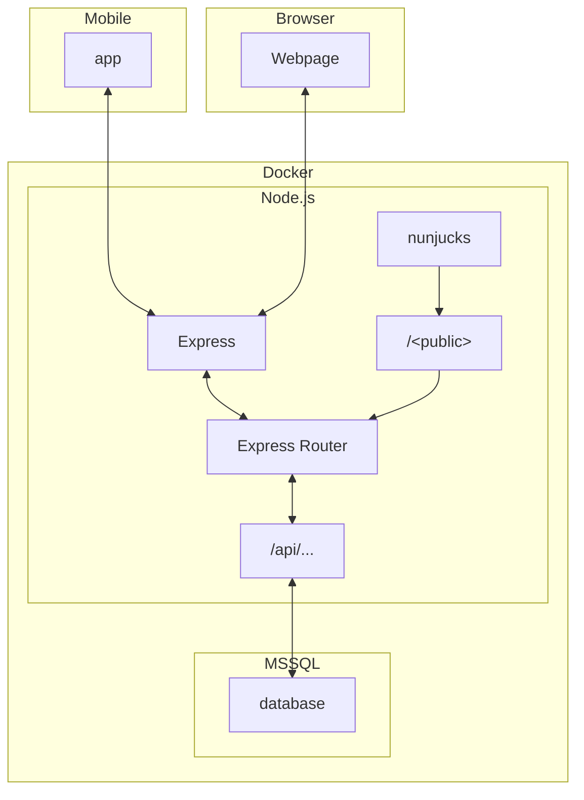

# WebDev

## Setup For Use

For running this project using Docker compose, you may use the following Docker compose file

```yaml
services:
  database:
    image: mcr.microsoft.com/mssql/server:2022-latest
    restart: unless-stopped
    container_name: databased
    ports:
      - 1433:1433
    environment:
      - "ACCEPT_EULA=Y"
      - "MSSQL_SA_PASSWORD=Password123"
    hostname: databased
  server:
    image: samhaswon/webdev-server:latest   # Or use the `dev` tag for the latest changes
    container_name: webdev-server
    ports:
      - 3000:3000
    environment:
      - "NODE_ENV=development"
```

If this is part of a larger stack, you may need to set `NODE_ENV=development2`.

Alternatively, you may need to set up the network differently for the containers:

- Set `network_mode: bridge` for each container
- Set `AZURE_SQL_SERVER=` to the IP of the host in the server container. 
  - I.e.:
  ```yaml
    server:
      image: samhaswon/webdev-server:latest
      container_name: webdev-server
      ports:
        - 3000:3000
      environment:
        - "NODE_ENV=development"
        - "AZURE_SQL_SERVER=10.8.0.5"
      network_mode: bridge
    ```

## Setup For Development

For the mobile team, the above instructions should be sufficient. For developers of this repository, please see the instructions in the [Backend README](./backend/README.md).

## Layout


